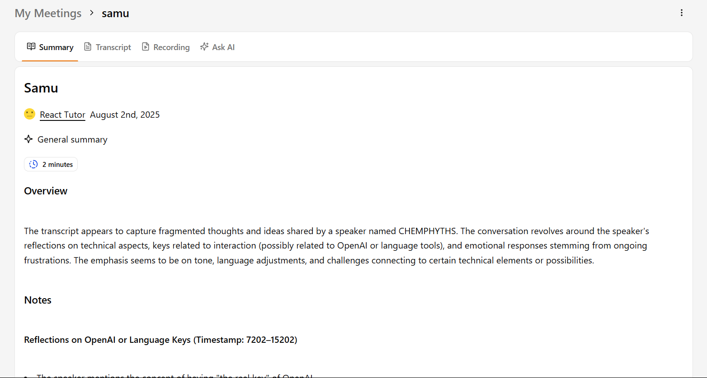

# 🎤 Voxa AI - Your AI Teammate in Every Meeting

<div align="center">
  
  
  **The Voice in the Call That Never Forgets**
  
  [](https://nextjs.org/)
  [](https://www.typescriptlang.org/)
  [](https://tailwindcss.com/)
  [](https://azure.microsoft.com/en-us/services/openai/)
</div>

## 🚀 Overview

Voxa AI is a revolutionary voice intelligence platform that redefines how teams collaborate in meetings. By combining cutting-edge AI technology with real-time voice processing, we've created an intelligent assistant that acts as your perfect meeting companion - listening, understanding, and contributing just like a human teammate.

### 🎯 What is Voxa AI?

Voxa AI transforms your meetings from passive listening sessions into dynamic, productive collaborations. Our AI agents are designed to:

- **Listen Actively** - Capture every word with enterprise-grade speech recognition
- **Think Intelligently** - Process context and understand conversation nuances
- **Respond Naturally** - Generate human-like responses with appropriate timing
- **Remember Everything** - Maintain context across entire meeting sessions
- **Summarize Effectively** - Extract key insights and action items automatically

### 🏢 Who is it for?

**Enterprise Teams**
- Sales teams conducting client meetings
- Product teams running sprint planning
- Executive teams in board meetings
- Customer success teams in support calls

**Remote & Hybrid Workforces**
- Distributed teams across time zones
- Remote-first companies
- Freelancers and consultants
- Educational institutions

**High-Stakes Scenarios**
- Legal consultations and depositions
- Medical consultations and telemedicine
- Financial advisory sessions
- Research interviews and focus groups

### 💡 How it Works

1. **Setup Your AI Agent** - Define your agent's personality, expertise, and meeting role
2. **Join Your Meeting** - Integrate seamlessly with Zoom, Teams, Google Meet, or any video platform
3. **Let AI Assist** - Your agent listens, processes, and contributes in real-time
4. **Get Insights** - Receive comprehensive summaries, action items, and meeting analytics

### 🚀 Key Benefits

**For Meeting Participants:**
- Never miss important details or action items
- Focus on the conversation while AI handles note-taking
- Get instant clarification and follow-up questions
- Maintain engagement with intelligent conversation flow

**For Meeting Organizers:**
- Ensure meeting objectives are met
- Track participation and engagement
- Generate professional meeting records
- Improve meeting effectiveness over time

**For Organizations:**
- Reduce meeting fatigue and improve productivity
- Standardize meeting processes and outcomes
- Enhance knowledge retention and sharing
- Scale meeting intelligence across teams

### ✨ Key Features

- **🎧 Real-Time Voice Recognition** - Advanced speech-to-text with Azure Speech Services
- **🗣️ Natural Voice Synthesis** - Human-like AI responses with context awareness
- **📹 Meeting Integration** - Seamless integration with video conferencing platforms
- **📝 Auto Summaries** - Intelligent meeting summaries and action item extraction
- **🧠 Context Memory** - Remembers conversation history throughout meetings
- **👥 Team Collaboration** - Enhances team dynamics and ensures inclusivity
- **🔒 Enterprise Security** - Secure, private, and compliant voice processing
- **🎯 Customizable Agents** - Tailor AI behavior to specific meeting types and roles
- **📊 Analytics Dashboard** - Track meeting effectiveness and team performance
- **🔄 Multi-Platform Support** - Works with any video conferencing solution
## Live Link
Navigate to [https://voxaai-six.vercel.app](https://voxaai-six.vercel.app)

## 📸 Screenshots & Demo

<div align="center">
  <h3>🎥 Application Interface</h3>
  
  
  <p><em>Main dashboard</em></p>
  

  
  
  <p><em>Real-time voice agent with speech recognition and synthesis</em></p>
  
  
  <p><em>Active meeting with AI agent integration</em></p>
  
  
  
  
  
  <p><em>Automated meeting summary and action items</em></p>
</div>

## 🏗️ Tech Stack

### Frontend
- **Next.js 15.4.4** - React framework with App Router
- **React 19** - Latest React with concurrent features
- **TypeScript 5** - Type-safe development
- **Tailwind CSS 4** - Utility-first CSS framework
- **Framer Motion** - Smooth animations and transitions
- **Radix UI** - Accessible component primitives
- **Lucide React** - Beautiful icons

### Backend & API
- **tRPC** - End-to-end typesafe APIs
- **Next.js API Routes** - Serverless API endpoints
- **Better Auth** - Authentication system
- **Inngest** - Background job processing

### Database & ORM
- **PostgreSQL** - Primary database (Neon serverless)
- **Drizzle ORM** - Type-safe database queries
- **Drizzle Kit** - Database migrations and schema management

### AI & Voice Services
- **Azure OpenAI** - GPT models for conversation intelligence
- **Azure Speech Services** - Speech recognition and synthesis
- **Microsoft Cognitive Services** - Advanced speech processing

### Real-time Communication
- **Stream Video** - Video conferencing infrastructure
- **Stream Chat** - Real-time messaging
- **WebSocket** - Real-time data streaming

### Development Tools
- **ESLint** - Code linting
- **Prettier** - Code formatting
- **Dicebear** - Avatar generation
- **React Hook Form** - Form management
- **Zod** - Schema validation

## 📁 Project Structure

```
VoxaAi/
├── src/
│   ├── app/                    # Next.js App Router
│   │   ├── (dashboard)/        # Protected dashboard routes
│   │   ├── api/               # API endpoints
│   │   ├── auth/              # Authentication pages
│   │   └── call/              # Voice call interface
│   ├── components/            # Reusable UI components
│   │   ├── ui/               # Shadcn/ui components
│   │   └── voice-agent/      # Voice agent components
│   ├── modules/              # Feature modules
│   │   ├── agents/           # AI agent management
│   │   ├── meetings/         # Meeting management
│   │   ├── dashboard/        # Dashboard components
│   │   └── home/            # Landing page
│   ├── db/                  # Database schema and config
│   ├── hooks/               # Custom React hooks
│   ├── lib/                 # Utility libraries
│   └── trpc/                # tRPC configuration
├── public/                  # Static assets
└── drizzle/                # Database migrations
```

## 🔄 Application Flow

### 1. User Authentication


### 2. AI Agent Creation


### 3. Meeting Flow


### 4. Voice Processing Pipeline


## 🛠️ Getting Started

### Prerequisites

- Node.js 18+ 
- PostgreSQL database (Neon recommended)
- Azure Speech Services account
- Azure OpenAI account
- Stream account for video/chat

### Installation

1. **Clone the repository**
   ```bash
   git clone https://github.com/your-username/VoxaAi.git
   cd VoxaAi
   ```

2. **Install dependencies**
   ```bash
   npm install
   ```

3. **Set up environment variables**
   ```bash
   cp .env.example .env.local
   ```
   
   

4. **Set up the database**
   ```bash
   npm run db:push
   ```

5. **Run the development server**
   ```bash
   npm run dev
   ```

6. **Open your browser**
   Navigate to [http://localhost:3000](http://localhost:3000)

### Environment Variables

Create a `.env.local` file with the following variables:

```bash
# Database
DATABASE_URL="your-postgresql-connection-string"

# Authentication
GOOGLE_CLIENT_ID="your-google-client-id"
GOOGLE_CLIENT_SECRET="your-google-client-secret"
GITHUB_CLIENT_ID="your-github-client-id"
GITHUB_CLIENT_SECRET="your-github-client-secret"

# Azure OpenAI
AZURE_OPENAI_ENDPOINT="https://your-resource.openai.azure.com"
AZURE_OPENAI_KEY="your-azure-openai-key"
AZURE_OPENAI_DEPLOYMENT="your-deployment-name"
AZURE_OPENAI_API_VERSION="2024-02-15-preview"

# Azure Speech Services
NEXT_PUBLIC_AZURE_SPEECH_KEY="your-azure-speech-key"
NEXT_PUBLIC_AZURE_SPEECH_REGION="your-azure-speech-region"
NEXT_PUBLIC_AZURE_OPENAI_ENDPOINT="https://your-resource.openai.azure.com"
NEXT_PUBLIC_AZURE_OPENAI_KEY="your-azure-openai-key"
NEXT_PUBLIC_AZURE_OPENAI_DEPLOYMENT="your-deployment-name"

# Stream Services
STREAM_API_KEY="your-stream-api-key"
STREAM_API_SECRET="your-stream-api-secret"
STREAM_CHAT_API_KEY="your-stream-chat-api-key"
STREAM_CHAT_API_SECRET="your-stream-chat-api-secret"
```

## 🚀 Available Scripts

- `npm run dev` - Start development server
- `npm run build` - Build for production
- `npm run start` - Start production server
- `npm run lint` - Run ESLint
- `npm run db:push` - Push database schema changes
- `npm run db:studio` - Open Drizzle Studio
- `npm run dev:webhook` - Start ngrok for webhooks
- `npm run dev:inngest` - Start Inngest dev server

## 🎯 Core Features

### AI Voice Agent
- Real-time speech recognition and synthesis
- Context-aware conversations
- Customizable agent instructions
- Voice activity detection

### Meeting Management
- Schedule and join meetings
- AI agent integration
- Real-time transcription
- Meeting summaries and insights

### Dashboard
- Agent management interface
- Meeting history and analytics
- User settings and preferences
- Team collaboration tools

## 🔧 Development

### Database Schema

The application uses the following main entities:

- **Users** - Authentication and user profiles
- **Agents** - AI agent configurations
- **Meetings** - Meeting sessions and metadata
- **Sessions** - User authentication sessions

### API Structure

- **tRPC Routers** - Type-safe API endpoints
- **Next.js API Routes** - Serverless functions
- **Inngest Functions** - Background job processing

### Component Architecture

- **Module-based** - Features organized in modules
- **Atomic Design** - Reusable UI components
- **Type Safety** - Full TypeScript coverage

## 🚀 Deployment

### Vercel (Recommended)

1. Connect your GitHub repository to Vercel
2. Configure environment variables
3. Deploy automatically on push

### Other Platforms

The application can be deployed to any platform that supports Next.js:
- Netlify
- Railway
- DigitalOcean App Platform
- AWS Amplify

## 🤝 Contributing

1. Fork the repository
2. Create a feature branch (`git checkout -b feature/amazing-feature`)
3. Commit your changes (`git commit -m 'Add amazing feature'`)
4. Push to the branch (`git push origin feature/amazing-feature`)
5. Open a Pull Request

## 📄 License

This project is licensed under the MIT License - see the [LICENSE](LICENSE) file for details.

## 🆘 Support

- 📧 Email: support@voxaai.com
- 💬 Discord: [Join our community](https://discord.gg/voxaai)
- 🐛 Issues: [GitHub Issues](https://github.com/your-username/VoxaAi/issues)

## 🙏 Acknowledgments

- [Azure Speech Services](https://azure.microsoft.com/en-us/services/cognitive-services/speech-services/) for voice processing
- [OpenAI](https://openai.com/) for AI language models
- [Stream](https://stream.io/) for real-time communication
- [Vercel](https://vercel.com/) for hosting and deployment
- [Shadcn/ui](https://ui.shadcn.com/) for beautiful components

---

<div align="center">
  Made with ❤️ by the Akash Jha
  
  [Website](https://voxaai-six.vercel.app) • [Instagram](https://twitter.com/voxaai) • [LinkedIn](https://linkedin.com/company/voxaai)
</div>